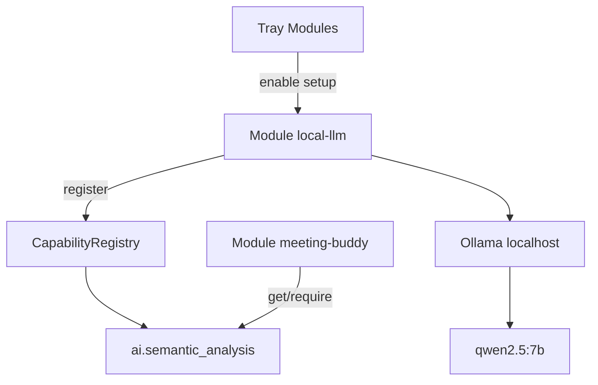

# Design — Local LLM-module + Meeting Buddy agenda-review

- **Datum:** 2026-07-23
- **Status:** Geaccepteerd (nog niet geïmplementeerd)
- **Branch:** `docs/local-first-llm-meeting-buddy` (implementatie later o.a.
  `feat/local-llm-module`)
- **ADR:** [0004 — Local-first inference](../../adr/0004-local-first-inference.md)
- **Gerelateerd:**
  [2026-07-19-capability-registry-design.md](2026-07-19-capability-registry-design.md),
  [2026-07-19-meeting-buddy-mvp-design.md](2026-07-19-meeting-buddy-mvp-design.md),
  [2026-07-22-meeting-buddy-transcript-stream-design.md](2026-07-22-meeting-buddy-transcript-stream-design.md),
  [RFC-MeetingBuddy-02.md](../../RFC-MeetingBuddy-02.md)

## Probleem

1. Meeting Buddy mist **agenda-review**: per agendapunt een ingedikte
   samenvatting + oordeel `covered` / `thin` / `missing`.
2. Dat vraagt een LLM. Die runtime mag **niet** alleen in Meeting Buddy
   zitten: andere modules moeten dezelfde lokale AI kunnen gebruiken
   (capability-patroon, zoals SharedWhisper / `speech-to-text`).

## Doel (v1)

Twee lagen op dezelfde module-hoogte:

| Laag | Rol |
|------|-----|
| **Module `local-llm`** | First-class praatMaar-module (tray **Modules**); Ollama + Qwen 2.5 setup; registreert `ai.semantic_analysis` |
| **Meeting Buddy** | Consumer: optionele agenda-review via die capability; geen eigen Ollama-client |

Geen cloud. Zonder `local-llm` blijft dicteren en Meeting Buddy (heuristieken +
transcript) werken.

## Beslissingen

| Onderwerp | Keuze |
|-----------|--------|
| Module-id | `local-llm` (displaynaam via i18n, bijv. “Local LLM”) |
| Capability | `ai.semantic_analysis` (bestaand ID; Protocol uitbreiden t.o.v. MVP-stub) |
| Runtime v1 | Ollama op `http://127.0.0.1:11434` |
| Default model | `qwen2.5:7b` (`qwen2.5:3b` als lite-config) |
| Module default | **uit** (zoals Meeting Buddy) |
| Setup-UI | Acties/status op de **local-llm**-module (Modules-dialoog ± eigenschappen) |
| Meeting Buddy | Toggle “agenda-review”; enabled alleen als capability healthy |
| Eigen endpoint | **Buiten v1-UI** (config mag al velden reserveren) |
| Analyse-moment MB | Primair bij **meeting-stop** |

## Deel A — Module `local-llm`

### Verantwoordelijkheden

- Detecteren of Ollama bereikbaar is (`GET /api/tags` of gelijkwaardig).
- Begeleiden bij Ollama-installatie (link naar officiële installer; geen stille
  admin-install).
- Model pull: `ollama pull qwen2.5:7b` (subprocess of pull-API) met voortgang.
- Config onder `%APPDATA%\praatMaar\local-llm\config.json` (via
  `settings_store`), o.a. `ollama_base_url`, `ollama_model`.
- Bij `on_app_start` (als enabled): capability **registeren** wanneer health OK
  (of registeren met “degraded”-gedrag dat `require`/aanroepen netjes faalt —
  implementatie kiest één duidelijk patroon; voorkeur: alleen registeren als
  model klaar is).
- Bij shutdown: `unregister_owner`.
- HTTP-client naar Ollama; **geen** transformers in de praatMaar-venv.

### Capability-contract (richting)

Bestaande stub (`analyze_delta`) is MVP-placeholder. Voor v1 uitbreiden zodat
consumers o.a. kunnen:

- Health/status opvragen (klaar / model ontbreekt / offline).
- Een **gestructureerde analyse** uitvoeren met prompt + verwachte
  JSON-vorm (generiek genoeg voor Meeting Buddy én latere modules).

Concrete methodenamen en types: vastleggen in
`modules/capabilities/semantic_analysis.py` + contracttests bij implementatie.
Breaking change t.o.v. de lege stub is acceptabel (geen productieprovider nu).

### UX (Modules)

```text
Modules → Local LLM (enabled)
  ├─ Status: Ollama niet gevonden → [Ollama installeren…] [Opnieuw controleren]
  ├─ Status: model ontbreekt → [Qwen 2.5 downloaden]
  └─ Status: Klaar (model + endpoint)
```

Tray-acties optioneel (`ModuleWithActions`) voor “status / opnieuw controleren”.

## Deel B — Meeting Buddy als consumer

### Verantwoordelijkheden

- Eigen voorkeur `llm_review_enabled` (default `false`) in meeting-buddy-config.
- Geen Ollama-URL/model-duplicatie: dat leeft in `local-llm`.
- Bij stop (als review aan én capability beschikbaar): agenda + transcript →
  capability-aanroep → review JSON + Markdown (`## Review` en/of
  `{stem}.review.json`).
- UI: korte status “Local LLM niet beschikbaar / schakel module Local LLM in”
  i.p.v. zelf installeren.
- Heuristische hints blijven; LLM vult review aan, vervangt de hint-engine niet.

### Review JSON (output van Meeting Buddy-pipeline)

```json
{
  "schema_version": 1,
  "model": "qwen2.5:7b",
  "generated_at": "2026-07-23T15:00:00",
  "topics": [
    {
      "id": "opening",
      "title": "Opening",
      "summary": "…",
      "coverage": "covered",
      "rationale": "…"
    }
  ]
}
```

`coverage` ∈ {`covered`, `thin`, `missing`}. Prompt: geen verzonnen
agendapunten; UI-taal waar zinvol; lege transcript → netjes `missing` of skip.

## Architectuur



## Scope

### In scope

- Builtin module `local-llm` + registry-entry (default uit)
- Uitgebreid `SemanticAnalysisCapability` + Ollama-provider
- Setup/status/pull-UI op die module
- Meeting Buddy: consume + stop-hook + persist review + locales/help
- Tests: mock capability / mock HTTP; geen Ollama in CI

### Expliciet buiten scope (v1)

- Eigen endpoint-UI / multi-model picker
- Cloud-providers
- Live LLM-hints tijdens opname
- Ollama bundelen in Setup.exe
- Vervangen van heuristische `HintEngine`

## Risico’s

| Risico | Mitigatie |
|--------|-----------|
| Module-volgorde (MB start vóór local-llm ready) | Review pas bij stop; opnieuw checken bij enable |
| 7B te zwaar | Config `qwen2.5:3b`; review niet tijdens zware Whisper-load forceren |
| Contract te smal (`analyze_delta` only) | Protocol bewust verbreden in dezelfde PR als de provider |

## Verificatie

- [ ] `local-llm` uit: geen capability; Meeting Buddy review-toggle disabled
- [ ] `local-llm` aan, Ollama/model klaar: capability registered
- [ ] Andere module (test-double) kan dezelfde capability gebruiken
- [ ] Meeting stop met review aan → JSON/MD; falen non-blocking
- [ ] Help noemt Local LLM-module + optionele agenda-review

## Volgende stappen

1. Smoke: Ollama + `qwen2.5:7b` op ontwikkel-notebook.
2. Implementatie: eerst `local-llm` + capability; daarna Meeting Buddy-consumer.
3. Later: eigen model/endpoint in `local-llm`-UI.
