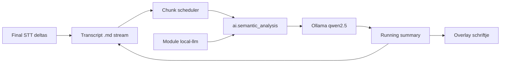

# Design — Local LLM-module + Meeting Buddy live review

- **Datum:** 2026-07-23 (bijgewerkt: live samenvatting als eerste stap)
- **Status:** Geaccepteerd (nog niet geïmplementeerd)
- **Branch:** `docs/local-first-llm-meeting-buddy` (implementatie later o.a.
  `feat/local-llm-module`)
- **ADR:** [0004 — Local-first inference](../../adr/0004-local-first-inference.md)
- **Gerelateerd:**
  [2026-07-19-capability-registry-design.md](2026-07-19-capability-registry-design.md),
  [2026-07-19-meeting-buddy-mvp-design.md](2026-07-19-meeting-buddy-mvp-design.md),
  [2026-07-22-meeting-buddy-transcript-stream-design.md](2026-07-22-meeting-buddy-transcript-stream-design.md),
  [2026-07-22-meeting-buddy-tray-ux-design.md](2026-07-22-meeting-buddy-tray-ux-design.md),
  [RFC-MeetingBuddy-02.md](../../RFC-MeetingBuddy-02.md)

## Probleem

Meeting Buddy heeft agenda-startflow, heuristische hints en een meegroeiend
transcript op schijf. Wat ontbreekt voor bruikbare live-ondersteuning:

1. Een **lopende samenvatting** van wat er besproken is, zichtbaar in het
   meeting-overzicht (“schriftje”), bijgewerkt tijdens de meeting.
2. Later: **per agendapunt** beoordelen of het adequaat behandeld is.
3. Later: **vragen van anderen** detecteren, helder herformuleren en tonen.

Dat vraagt een lokale LLM. Die runtime mag **niet** alleen in Meeting Buddy
zitten: andere modules moeten dezelfde AI kunnen gebruiken (capability-patroon).

## Doel — gefaseerd

| Fase | Wat | Status in dit ontwerp |
|------|-----|------------------------|
| **0** | Agenda invullen/selecteren → meeting starten | **Bestaat** — geen wijziging |
| **1 (eerste bouw)** | Transcript streamt; configureerbare LLM-chunks; **live samenvatting** in meeting-UI | **v1-scope** |
| **2** | Per agendapunt `covered` / `thin` / `missing` + korte rationale | Volgt na fase 1 |
| **3** | Vragen uit transcript → helder geformuleerd + zichtbaar in UI | Volgt na fase 2 |

Twee module-lagen (ongewijzigd t.o.v. ADR-0004):

| Laag | Rol |
|------|-----|
| **Module `local-llm`** | Modules-tray; Ollama + Qwen 2.5 setup; registreert `ai.semantic_analysis` |
| **Meeting Buddy** | Consumer: chunk-scheduler + UI voor samenvatting (later coverage/vragen) |

Zonder `local-llm` blijft Meeting Buddy werken (hints + transcript stream), zonder
LLM-samenvatting.

## Beslissingen (fase 1)

| Onderwerp | Keuze |
|-----------|--------|
| Agenda-flow | Ongewijzigd (bestaande dialoog / snelle start) |
| Transcript | Blijft **final STT-deltas** appenden naar `.md` (bestaand journal) |
| LLM-input | Leest het **meegroeiende transcriptbestand** (en/of in-memory buffer gelijkwaardig) |
| Chunk / interval | **Configureerbaar** in Meeting Buddy (tijd én/of nieuw tekstvolume) — default conservatief voor notebooks |
| Analyse-moment fase 1 | **Periodiek tijdens de meeting** (op chunk), niet alleen bij stop |
| Eerste LLM-product | **Eén lopende samenvatting** (running summary) van besproken inhoud |
| UI | Samenvatting zichtbaar in Meeting Buddy-overlay/overzicht (“schriftje”); overlay toont nu nog géén transcript — dit is een bewuste uitbreiding |
| Module `local-llm` | Zoals ADR: setup, health, capability; geen Meeting Buddy-specifieke prompts |
| Eigen endpoint | Buiten v1-UI |

### Chunk-config (richting)

Voorbeeldconfig (namen bij implementatie vastleggen):

- `llm_chunk_interval_s` — minimale seconden tussen LLM-aanroepen (bijv. 45–120)
- `llm_chunk_min_new_chars` — minimale nieuwe transcripttekst sinds vorige aanroep
- Beide: aanroep pas als **beide** drempels gehaald zijn (of OR — implementatie
  kiest één; voorkeur **AND** om laptop te ontzien)

Gebruiker kan interval verhogen op een zwaardere load / zwakkere machine.

## Architectuur (fase 1)

- Scheduler zit in Meeting Buddy; HTTP/Ollama alleen in `local-llm`.
- Samenvatting: in overlay tonen **én** optioneel syncen naar het `.md`
  (sectie `## Samenvatting` die bij elke chunk wordt vervangen/bijgewerkt).

## Deel A — Module `local-llm` (ongewijzigd van kern)

Zie eerdere beslissing: detectie, installatiebegeleiding, `ollama pull`,
config, register `ai.semantic_analysis` alleen als healthy, generieke
gestructureerde analyse-API. Meeting Buddy-prompts horen **niet** in deze module.

## Deel B — Meeting Buddy consumer

### Fase 1 — live samenvatting

- Voorkeur `live_summary_enabled` (default `false`) + chunk-settings.
- Alleen actief als capability beschikbaar is.
- Bij elke chunk: stuur (recent) transcript + vorige samenvatting → nieuwe
  compacte samenvatting (NL/EN/DE volgens UI-taal).
- Overlay: paneel “Samenvatting” / schriftje met laatste tekst; niet-blocking
  bij trage LLM (toon “bezig…” / behoud vorige tekst).
- Falen: loggen; meeting en transcript gaan door.

### Fase 2 — agendapunt-dekking (later)

- Zelfde chunk- of stop-moment; output per topic: `summary`, `coverage`,
  `rationale` (JSON zoals eerder geschetst).
- UI: checklist naast agenda in overlay.

### Fase 3 — vragen (later)

- Detecteer vragen gesteld door anderen (niet alleen de host).
- Herformuleer tot één heldere vraagzin.
- Toon als aparte lijst in overlay (cap, dedupe, cooldown — nader te bepalen).

## Scope

### In scope (eerste implementatie-PR’s)

1. Builtin module `local-llm` + capability-uitbreiding
2. Meeting Buddy: chunk-scheduler + live running summary + overlay-paneel
3. Config chunk-interval / min-tekst; locales; tests met mocks
4. Help: Local LLM-module + optionele live samenvatting

### Expliciet buiten eerste implementatie

- Fase 2 (coverage) en fase 3 (vragen) — wel gereserveerd in dit document
- Vervangen van heuristische `HintEngine`
- Cloud / eigen-endpoint-UI
- Ollama in Setup.exe bundelen

## Risico’s

| Risico | Mitigatie |
|--------|-----------|
| Te frequente LLM-calls op notebook | Configureerbare chunks; default conservatief; AND-drempels |
| Overlay te druk | Samenvatting compact; hints blijven max. 3 |
| Samenvatting “drifft” | Altijd vorige summary + nieuwe transcript-delta megeven |
| Budget/thin vs covered | Fase 2: prompt-kalibratie (smoke toonde al nuance-gaten) |

## Verificatie (fase 1)

- [ ] Agenda-flow ongewijzigd
- [ ] Zonder `local-llm`: geen samenvatting, wel transcript stream
- [ ] Met `local-llm` + toggle: samenvatting vernieuwt op chunk-interval
- [ ] Interval verhogen → minder Ollama-aanroepen
- [ ] Overlay toont samenvatting; transcript `.md` blijft groeien
- [ ] Unit-tests met mock capability

## Volgende stappen

1. Implementatie `local-llm` + capability (onafhankelijk smoke Ollama al gedaan).
2. Meeting Buddy fase 1: scheduler + schriftje-samenvatting.
3. Daarna fase 2 (coverage) en fase 3 (vragen) als aparte specs/PR’s.
