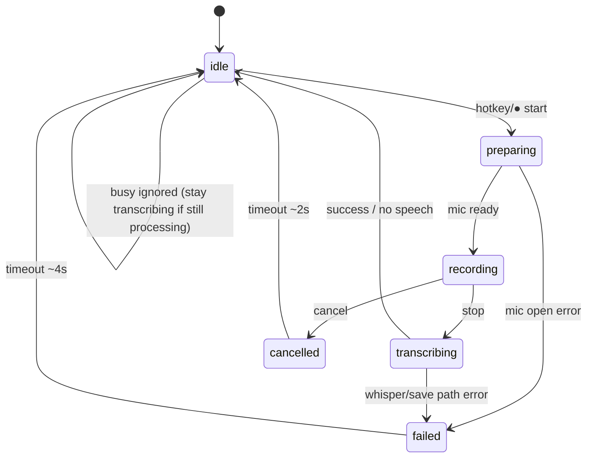

# UX state specification & review — dicteercyclus

## Status

**Accepted** — 2026-08-01 (human owner).

- FR-UX-01–04: accepted (Must for v1.0 dicteercyclus UX)
- FR-UX-05: **B** — transient ready-pill ~3–5 s na splash (non-activating,
  hotkey-hint); geen permanente idle-HUD zonder bestemming

Scope: **dicteercyclus only** (status-pill, tray state, hotkey, mic error, idle/ready).
**Out of scope:** Meeting Buddy overlay graduation, dual-waveform MB polish, Local LLM.

v1.0 context: [2026-08-01-v1-support-scope-product.md](2026-08-01-v1-support-scope-product.md)
(Accepted: Windows core dictation primary). Prefer copy/focus fixes over new settings;
Dutch UI copy.

---

# Part A — UX state specification

## User and context

- **User:** Windows dicteergebruiker (v1.0 primaire belofte); cursor in een
  tekstveld; start/stop via sneltoets (toggle of PTT) of idle-pill ●/■.
- **Task:** één dicteercyclus — opname → lokale Faster-Whisper → opslaan /
  optioneel plakken — zonder de focus van het doelveld te verliezen.
- **Interruption level:** hotkey-workflow moet snel en omkeerbaar blijven;
  fouten mogen niet de typcontext stelen.
- **First-run:** splash → model geladen → tray; Help “Aan de slag” beschrijft
  hotkey + plakken. Idle-pill is **verborgen** zonder sticky bestemming.

## Surfaces in scope

| Surface | Rol |
|---------|-----|
| Status-pill (`indicator._qt` + `_contract`) | Primaire dicteerstatus; non-activating HUD |
| Systeemvak (`ui/tray.py`) | Icoonkleur + tooltip; mic-attention badge |
| Console / log | Geen UX-surface — mag niet de enige busy/foutfeedback zijn |
| Mic-foutpad | Vandaag: tray attention + **modale** `QMessageBox.critical` |
| Instellingen → Herstel-audio | Post-cycle herstel (recovered-pad), geen pill-state |
| Help (`docs/user/help.nl.md`) | Aan de slag + privacy/SmartScreen |

**Niet in scope:** Meeting Buddy overlay, Modules-IA, bestemmingen-dialoog (idle
bestemmingspill wel als idle-indicator).

## Current implementation snapshot

**`RecordingState`** (`indicator/_contract.py`):
`IDLE` · `RECORDING` · `TRANSCRIBING` · `CANCELLED` · `ERROR`.

**Notify-punten (`Opnamesessie`):**

| Moment | State |
|--------|-------|
| `start()` — vóór stream open | `RECORDING` |
| Mic-start faalt | `ERROR` (+ `_on_user_error` → modal) |
| Te kort / geen audio | `IDLE` |
| Stop met audio | `TRANSCRIBING` (blijft tot deliver klaar) |
| Succes / klaar | `IDLE` |
| Transcriptiefout | `ERROR` → daarna idle-events |
| Annuleren tijdens opname | `CANCELLED` |

**Pill focus flags:** `apply_hud_window_flags` —
`Qt.Tool | Frameless | WindowStaysOnTopHint | WindowDoesNotAcceptFocus`,
`WA_ShowWithoutActivating`; Windows Qt 6.9.2 → `WS_EX_NOACTIVATE`.

**Locales (`locales/nl.json` `state.*`):**
`recording` “Opname”, `transcribing` / `transcribing_progress`, `cancelled`,
`error` “Mislukt”, `ready` “Gereed”, `cancelled_note` “niets ingevoegd”,
tags toggle/ptt/meeting. ERROR-pill toont **geen** next-step-subline (alleen
optioneel hotkey-label rechts).

**Busy:** bij `_processing` print `dictation.busy` / `rec.busy` — **geen** aparte
pill-transitie; pill zou `TRANSCRIBING` moeten blijven tot `_notify(IDLE)`.

**Mic modal:** `dictation._report_user_error` → `ui.dialogs.message.error` →
`QMessageBox.critical(parent=indicator)` — **activeert app / steelt focus**.

## Product ↔ implementation state map

| Product state | Intent | Implemented? | Gap |
|---------------|--------|--------------|-----|
| `idle` | Klaar, niet aan het opnemen | `IDLE` (+ verborgen pill zonder bestemming) | Idle vaak onzichtbaar (alleen tray) |
| `preparing` | Warm-up / device open — **nog geen** gebruikersopname | **Nee** — `RECORDING` vóór stream | **Must-gap:** false “Opname” |
| `recording` | Mic vangt audio voor deze act | `RECORDING` + waveform | OK ná stream ready |
| `paused` | Capture bewust gepauzeerd | **Nee** | **N/A v1.0** dicteercyclus (geen pause-actie) |
| `transcribing` | Audio→tekst | `TRANSCRIBING` + % | OK |
| `inserting` | Klembord/plakken bezig | **Nee** — valt onder `TRANSCRIBING` tot IDLE | Acceptabel als deliver kort blijft; anders subline |
| `cancelled` | Gebruiker afgebroken | `CANCELLED` (~2 s) | OK |
| `denied` | Toestemming geweigerd | Geen enum — `ERROR` + `rec.mic_permission` in modal | Copy-differentiatie op pill; geen nieuwe enum verplicht |
| `unavailable` | Device/model weg of bezig | Deels: busy console; mic → `ERROR` + tray attention | Busy moet UI-zichtbaar; unavailable ≠ silent |
| `failed` / `error` | Fout met begrip + next step | `ERROR` “Mislukt” (~4 s) | **Must-gap:** next-step op pill |
| `recovered` | Herstelpad na fout | Geen cycle-state; Instellingen Herstel-audio | Post-cycle OK; pill mag wijzen naar Instellingen |

## State model

### idle

| Field | Spec |
|-------|------|
| Trigger | Start; einde cyclus; te kort/geen audio; ERROR/CANCELLED timeout |
| Visible indicator | Zonder bestemming: pill **verborgen**; tray idle-icoon. Met bestemming: idle-pill naam + ● + × |
| Text / icon | Bestemmingsnaam; subline `state.ready` + hotkey indien gezet. Tray: `tray.tooltip.idle` |
| Audio | Niet capturen (warme stream mag open blijven — implementatiedetail, niet claimen als “opname”) |
| Permitted actions | Hotkey start; idle ● start; tray Instellingen/Help; × verbergt bestemmingspill |
| Focus | Geen activatie door pill |
| Keyboard | Globale sneltoets werkt |
| Accessibility | Tray tooltip “gereed”; bestemmingspill heeft zichtbare naam + startknop |
| Transitions | → preparing/recording (start); (splash aparte fase) |
| Timeout | — |
| Error fallback | Probe/attention kan tray-badge zetten zonder pill |
| Platform | Win primair; mac zelfde betekenis |

### preparing *(product state — vandaag gap)*

| Field | Spec |
|-------|------|
| Trigger | Gebruiker start dicteren; stream/device nog niet klaar |
| Visible indicator | Pill zichtbaar; **niet** rode “Opname”-claim met waveform alsof audio al loopt |
| Text / icon | Voorstel NL: **“Microfoon…”** of **“Voorbereiden”** (nieuwe key bv. `state.preparing`); vorm ≠ recording-dot |
| Audio | Nog geen gebruikersopname-frames (of buffers nog niet betrouwbaar) |
| Permitted actions | Annuleren toegestaan indien start al gelatcht; geen “spreek nu”-claim |
| Focus | Non-activating |
| Transitions | → `recording` bij mic ready; → `failed`/`unavailable`/`denied` bij open-fout |
| Timeout | Kort; bij falen meteen foutpad |
| Error fallback | Geen false recording-flash langer dan één frame-poll indien vermijdbaar |
| Platform | Zelfde betekenis Win/Mac |

**Implementatiekeuze (aanbevolen):** ofwel (A) `notify` pas `RECORDING` ná succesvolle stream-open + optionele korte preparing-notify, ofwel (B) nieuw `RecordingState.PREPARING`. Geen settings-toggle. Owner: `core-python-architect` (+ UX copy).

### recording

| Field | Spec |
|-------|------|
| Trigger | Mic stream open en capture voor deze sessie actief |
| Visible indicator | Rode pulserende dot + waveform + mode-tag; ■ stop (toggle) / PTT hold |
| Text | `state.recording` “Opname” |
| Audio | Capturing |
| Permitted actions | Stop (hotkey/■); cancel (bestaande cancel-route); geen Instellingen-steal |
| Focus | Non-activating; klik ■ mag target-focus niet stelen |
| Transitions | → `transcribing` (stop); → `cancelled`; → `failed` (zeldzame mid-capture fout) |
| Accessibility | Vorm (dot) + label; niet alleen kleur |

### paused

**v1.0 dicteercyclus: niet ondersteund.** Geen FR. Meeting Buddy mag eigen pause later hebben — buiten deze spec.

### transcribing

| Field | Spec |
|-------|------|
| Trigger | Stop met voldoende audio; Whisper/chunk-finalize loopt |
| Visible indicator | Oranje status + marching dots; optioneel `state.transcribing_progress` |
| Text | “Transcriberen” / “Transcriberen {percent}%” |
| Audio | Capture gestopt voor deze cyclus |
| Permitted actions | **Geen** tweede start; hotkey → busy-feedback (zichtbaar, niet alleen console) |
| Focus | Non-activating |
| Transitions | → `idle` (succes, te korte speech, saved-only); → `failed` (transcriptiefout); deliver/plakken blijft onder deze state tot klaar (*inserting* niet apart tenzij paste merkbaar traag) |
| Timeout | Geen auto-hide tijdens verwerking |
| Accessibility | Voortgangstekst helpt; busy moet screen-reader/tray-tooltip dekken |

### inserting *(product — optioneel samengevoegd)*

| Field | Spec |
|-------|------|
| Trigger | Na transcript: klembord + `host.paste` / modifier-wait |
| Visible | **v1 default:** blijf `TRANSCRIBING` tot IDLE (geen aparte enum) |
| Gap rule | Als paste/modifier-wait regelmatig > ~0,5 s voelt als “vast”, dan subline “Plakken…” of korte `inserting`-weergave — product-owner beslist alleen bij bewijs |
| Focus | Focus **moet** op doelapp blijven (paste inject) |

### cancelled

| Field | Spec |
|-------|------|
| Trigger | Gebruiker annuleert tijdens opname |
| Visible | ~2 s (`CANCELLED_DURATION_MS`); gedempte vorm + `state.cancelled` + `state.cancelled_note` |
| Audio | Gestopt; niets getranscribeerd/geplakt |
| Actions | Wacht tot idle; daarna opnieuw starten |
| Focus | Non-activating |
| Transitions | → `idle` |

### denied

| Field | Spec |
|-------|------|
| Trigger | OS weigert mic (permission / TCC) |
| Visible | Zelfde ERROR-pill-familie; **subline/copy** uit `rec.mic_permission` + checklist-hint |
| vs failed | “Geen toestemming” ≠ generieke crash |
| Focus | **Geen modal** die focus steelt; tray attention + pill next-step; volledige checklist bij expliciet openen Instellingen/tray-dialoog |
| Actions | Open privacy/Instellingen via tray (bewuste activatie OK) |

### unavailable

| Field | Spec |
|-------|------|
| Trigger | Geen device, stale default (-1), bezet/processing, model niet klaar |
| Visible | Mic: ERROR + tray `attention_mic`. Busy: blijf `TRANSCRIBING` / toon busy op tray+pill |
| Text | Hergebruik `rec.mic_*`, `dictation.busy` — niet alleen console |

### failed / error

| Field | Spec |
|-------|------|
| Trigger | Mic-startfout; transcriptiefout; (zeldzaam) andere cycle-fout |
| Visible | ~4 s ERROR-pill (driehoek + “Mislukt”) + **verplichte next-step-subline**; tray attention bij mic |
| Text | Zie Locale / copy keys hieronder |
| Focus | Pill non-activating; **geen** auto-modal op hotkey-fout |
| Transitions | → `idle` na timeout; recovery via Herstel-audio blijft beschikbaar |
| Accessibility | Driehoekvorm + tekst + subline |

### recovered

| Field | Spec |
|-------|------|
| Trigger | Gebruiker opent Herstel-audio en hermtranscribeert |
| Visible | Geen vaste pill-state; recovery-flow in Instellingen (bestaand) |
| Link from failed | ERROR-subline mag “Herstel-audio in Instellingen” tonen bij transcriptiefout met recovery-bestand |

## Transition map

**Illegaal / vermijden:** `recording`-label terwijl mic nog niet open;
`idle`-pill terwijl `_processing` true; modal focus-steal vanuit preparing/failed.

## Focus rules

1. Pill en andere HUD: nooit foreground/activate van praatMaar.
2. Tray-menu → Instellingen/Help/Bestemmingen: activatie **verwacht**.
3. Mic/transcriptfout na hotkey: **geen** `QMessageBox` die het dicteerveld steelt.
4. Volledige checklist-dialoog alleen na **expliciete** gebruikersactie (tray /
   Instellingen / “meer info”-actie).
5. Paste: focus blijft op doelapp.

## Keyboard behaviour

- Toggle: zelfde sneltoets start/stop; tijdens `transcribing`/processing: geen
  nieuwe opname; UI toont busy.
- PTT: hold = record, release = stop; tijdens processing: busy, geen start.
- Cancel: bestaande cancel-binding tijdens `recording` (niet tijdens transcribe).
- Pill ●/■: zelfde semantiek als hotkey; moet focus-safe blijven.

## Accessibility

- Status niet alleen via kleur: dot / marching dots / driehoek / gedempte cancel.
- Zinvolle namen: locale labels; tray tooltips per state + attention.
- Passieve pill: geen geforceerde focus.
- Schaal/high-contrast: bestaande donkere HUD; geen essentiële info alleen via
  chunk-LED-flits (chunk LEDs blijven experimenteel/opt-in).
- NL copy tenzij `ui_language` anders is.

## Platform differences (Windows / macOS)

| Topic | Windows (v1.0) | macOS (bron) |
|-------|----------------|--------------|
| Primary | Ondersteund | Runtime; zelfde state-betekenis |
| No-activate | Qt flags → `WS_EX_NOACTIVATE` | Flags + eventueel native seam (ADR-0002) indien regressie |
| Mic denied copy | `rec.check_privacy_win` | `rec.check_privacy_mac` + TCC docs |
| SmartScreen | Help Aan de slag | N.v.t. |

Linux: experimenteel; geen extra states voor 1.0.

## Locale / copy keys

**Bestaand (hergebruik):**
`state.recording`, `state.transcribing`, `state.transcribing_progress`,
`state.cancelled`, `state.cancelled_note`, `state.error`, `state.ready`,
`dictation.busy`, `rec.busy`, `rec.mic_*`, `rec.start_failed_*`, `rec.check_*`,
`tray.tooltip.*`, `tray.tooltip.attention_mic`.

**Voorstel nieuw / uitbreiding (NL eerst):**

| Key | Voorstel NL | Gebruik |
|-----|-------------|---------|
| `state.preparing` | Voorbereiden | preparing-pill |
| `state.error_mic_hint` | Controleer microfoon · tray | ERROR subline mic |
| `state.error_recovery_hint` | Herstel-audio in Instellingen | ERROR subline transcriptie+recovery |
| `state.error_retry_hint` | Opnieuw proberen met sneltoets | Generieke ERROR |
| `state.busy_hint` | Nog bezig… | Versterking indien nodig naast Transcriberen |

Geen parallelle taxonomie naast `rec.mic_*` — pill-hints kort; details in
Instellingen/Help.

## Gaps vs RecordingState / implementation

| Gap | Severity | Aanbevolen remedie |
|-----|----------|-------------------|
| False `RECORDING` vóór stream open | Must | preparing-gedrag of notify-na-ready |
| Modal mic error steelt focus | Must | Non-modal: pill subline + tray attention; checklist on-demand |
| ERROR pill zonder next-step | Must | Subline per foutklasse |
| Busy alleen console bij hotkey tijdens processing | Must | Pill/tray blijven/tonen busy (TRANSCRIBING of hint) |
| Idle onzichtbaar / first-run ready | Optional (PO) | Transient ready-cue na splash — zie product decision |
| Geen `denied`/`unavailable` enum | Should | Copy-differentiatie onder ERROR voldoende voor v1 |
| Geen `inserting` | Could | Alleen bij trage paste |
| Geen `paused` | N/A v1 | — |
| `recovered` niet in enum | OK | Herstel-audio IA |

## Functional requirements (Must + optional)

### FR-UX-01 — Focus-safe mic failure

Mic-startfout toont **geen** auto-modale dialoog die focus van het
dicteerdoel steelt. Gebruiker ziet: ERROR-pill met next-step + tray attention.
Volledige checklist beschikbaar na expliciete actie (tray/Instellingen).

### FR-UX-02 — Preparing vs false recording

Tussen start-intentie en succesvolle mic-open claimt de UI **niet** dat er al
wordt opgenomen (geen “Opname”+waveform alsof capture loopt). Ofwel korte
preparing-state/copy, ofwel `RECORDING` pas na mic ready.

### FR-UX-03 — Busy while transcribing visible

Zolang een cyclus verwerkt (`_processing` / transcribe+deliver), blijft de
zichtbare status busy (`TRANSCRIBING` of gelijkwaardig). Hotkey tijdens busy
levert **zichtbare** feedback (pill/tray), niet alleen console.

### FR-UX-04 — ERROR pill next-step copy

ERROR-pill toont naast “Mislukt” minstens één concrete next-step-subline
(mic → tray/Instellingen; transcriptie+recovery → Herstel-audio; anders retry).

### FR-UX-05 — First-run ready cue *(optional — product decision)*

**Decision needed:** na splash, eenmalig/kort een non-activating “Gereed ·
{hotkey}”-cue (pill of tray balloon), zonder permanente idle-HUD zonder
bestemming.

| Optie | Keuze |
|-------|--------|
| A | Geen extra cue — tray “gereed” + Help Aan de slag voldoende |
| **B (gekozen)** | Transient ready-pill ~3–5 s na splash |
| C | Idle-pill altijd zichtbaar met ready+hotkey (meer chrome — niet gekozen) |

**Besluit: B** — implementeren samen met Must 01–04.

## Acceptance criteria

- **AC-01** Given microfoon geweigerd/ontbreekt, When gebruiker start dicteercyclus
  via hotkey, Then het actieve tekstveld behoudt focus (geen auto-`QMessageBox`);
  And pill of tray toont actionable next step binnen 1 s.
- **AC-02** Given trage of falende mic-open, When start begint, Then de UI toont
  geen stabiele “Opname”-waveform-claim vóór capture ready; And bij falen volgt
  failed-pad zonder dat gebruiker denkt dat audio is opgenomen.
- **AC-03** Given `TRANSCRIBING`/processing, When gebruiker de sneltoets indrukt,
  Then pill of tray blijft/toont busy (niet stille idle-only + console).
- **AC-04** Given `ERROR`, When pill zichtbaar is, Then subline bevat een concrete
  next step in de UI-taal (nl default) zonder modal.
- **AC-05** *(als Decision FR-UX-05 = B)* Given eerste start na splash, When model
  klaar is, Then gebruiker ziet ≤5 s non-activating ready-cue met hotkey-hint.
- **AC-06** Given klik op pill tijdens recording/transcribing, When getest op
  Windows, Then doelapp blijft foreground (no-activate regressie).

## Review evidence required

- Manual Win10/11: hotkey dictation met Notepad/Word focus; mic unplugged /
  privacy denied; busy hotkey tijdens lange transcriptie; ERROR subline leesbaar.
- Automatisch: unit/contract tests voor notify-volgorde preparing→recording of
  recording-only-after-ready; test dat user-error path **geen** modal forceert
  (of modal alleen via expliciete API); locale keys aanwezig nl/en/de.
- Focus: bestaande overlay-flag tests + handmatige no-activate check (mockups ≠ bewijs).

## Open questions

1. FR-UX-05 ready-cue: ~~A / B / C?~~ **B** (Accepted).
2. Preparing: enum `PREPARING` vs notify-timing zonder enum?
3. Mag transcriptie-ERROR pill klikbaar naar Instellingen (focus-safe hit-target)
   of alleen copy-hint?
4. Inserting apart alleen na latency-meting?

## Agent ownership (implementation handoffs)

| Work | Owner | Consult |
|------|-------|---------|
| State meaning, copy, AC (deze spec) | `ux-product-design` | `product-owner` |
| `RecordingState` / `Opnamesessie` notify-volgorde, busy UI wiring | `core-python-architect` | `audio-speech`, UX |
| Mic error non-modal pad (`dictation._report_user_error`, message dialog policy) | `core-python-architect` | `ux-product-design`, `privacy-security` |
| Pill paint/subline, focus flags regressie | `core-python-architect` | `windows-platform` / `macos-platform` |
| Win no-activate / show path smoke | `windows-platform` | core |
| macOS nonactivating regressie indien geraakt | `macos-platform` | core |
| Locales + Help sync | `/update-documentation` | UX |
| Acceptatie Must AC | `product-owner` (human) | quality-release |
| Verificatie AC na implementatie | `quality-release` | — |

**Recommended next step after human accept of Must FR/AC:**  
`/implementation-plan` (slices: notify-order/preparing → non-modal error → ERROR
sublines → busy visibility). Gebruik `/feature-specification` alleen als PO
`PREPARING`-enum of ready-cue (FR-UX-05) als aparte productkeuze wil vastleggen
vóór planning — anders is deze Review-spec voldoende input voor het plan.

---

# Part B — UX state review report

## Decision

**Approved** (human owner, 2026-08-01)

Must FR-UX-01–04 and FR-UX-05 option **B** accepted. Spec is input for
`/implementation-plan`. Remaining open questions: PREPARING enum vs timing-only;
ERROR-pill click-through vs copy-only.

## Range / surfaces

Dicteercyclus: `Opnamesessie` ↔ `notify_state` ↔ pill/tray; mic error dialog;
idle/ready discoverability. Meeting Buddy overlay **uitgesloten**.

## Ambiguous states found

1. Preparing folded into `RECORDING` before stream open.
2. Denied/unavailable/failed collapsed to `ERROR` + modal/checklist.
3. Busy during processing primarily console (`dictation.busy`) if pill ever idle.
4. Idle without bestemming ≈ invisible “gereed”.
5. Inserting invisible (usually OK under TRANSCRIBING).

## Focus risks

| Risk | Severity |
|------|----------|
| `QMessageBox.critical(parent=indicator)` on mic fail | **Blocker** |
| Pill flags (no-activate) | Mitigated — keep under regression |
| Tray→Settings activation | Acceptable |

## Keyboard / accessibility gaps

- Busy feedback not AT-friendly if console-only.
- ERROR “Mislukt” without next-step fails actionable-error principle.
- Cancel unavailable during transcribe (OK); must remain obvious that app is busy.

## Platform inconsistencies

State *meaning* aligned; macOS may need extra nonactivating evidence if error UI
changes. Windows is acceptance primary for v1.0.

## Missing product states (gaps)

`preparing` (must behaviour), `denied`/`unavailable` (copy under ERROR),
`inserting` (optional), `paused` (N/A), `recovered` (settings path OK).

## Findings

### Blocker

1. **Focus-stealing mic modal** — `_report_user_error` → `QMessageBox.critical`.
2. **False RECORDING** — notify before `_ensure_stream()`.

### Should-fix (elevated to Must for v1.0 UX plan)

3. **ERROR pill next-step copy** missing (label-only “Mislukt”).
4. **Busy-while-transcribing** must remain visibly busy on pill/tray for hotkey
   re-entry (no silent idle + console-only).

### Nit / optional

5. First-run ready cue (FR-UX-05) — product decision; Help Aan de slag exists.
6. Distinct denied tray tooltip beyond `attention_mic` — nice-to-have.
7. too_short/no_audio → direct IDLE without transient note on pill — minor.

## Recommended next step

1. ~~Human PO: accept FR-UX-01–04; decide FR-UX-05 A/B/C~~ → Accepted (05 = B).
2. **`/implementation-plan`** for Must slices + transient ready-cue
   (prefer over another full `/feature-specification` unless enum choice needs a
   separate Accepted product note mid-implementation).
3. Handoffs: `core-python-architect` implement; platform agents for focus smoke;
   `/update-documentation` for locales/Help; `quality-release` vs AC-01–06.

---

## Document history

| Date | Change |
|------|--------|
| 2026-08-01 | Draft/Review from `/ux-state-review` (dicteercyclus only); grounded in code + v1.0 scope + earlier UX Must plan |
| 2026-08-01 | **Accepted:** FR-UX-01–04 + FR-UX-05 B |
