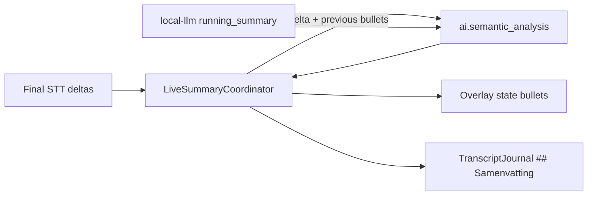

# Design — Meeting Buddy live samenvatting als bullets + delta + journal

- **Datum:** 2026-08-02
- **Status:** Geaccepteerd (nog niet geïmplementeerd)
- **Branch:** `docs/mb-live-summary-bullets`
- **ADR:** [0004 — Local-first inference](../../adr/0004-local-first-inference.md)
- **Gerelateerd:**
  [2026-07-23-local-llm-module-design.md](2026-07-23-local-llm-module-design.md),
  [2026-07-22-meeting-buddy-transcript-stream-design.md](2026-07-22-meeting-buddy-transcript-stream-design.md),
  [CONTEXT.md](../../../CONTEXT.md) (agenda-review / live samenvatting)

## Probleem

De live samenvatting is een lopende tekstparagraaf (“max ~8 zinnen”). De overlay
toont daarvan heuristisch max **3** zinnen. Input is telkens (bijna) het **hele**
transcript plus de vorige samenvatting. De samenvatting landt **niet** in het
meeting-`.md`.

Gevolg: het voelt als een hervertelling van het transcript, niet als een
scannable lopende samenvatting die tijdens én na de meeting bruikbaar is.

## Doel

Aanpak **A** (goedgekeurd):

1. **Vorm = UI** — model levert 3–5 bullets; overlay toont die 1:1.
2. **Delta-input** — alleen nieuwe transcripttekst sinds vorige succesvolle run
   + vorige bulletlijst.
3. **Journal** — sectie `## Samenvatting` in het transcript-`.md` bij elke
   geslaagde update vervangen.

Geen bullet-categorieën (besluit / actie / open). Geen eindpass bij stop in deze
slice.

## Non-goals

- Labels of types per bullet
- Management-/chronologische-/besluiten-samenvattingen na afloop (RFC-03)
- Contractversie-bump van `ai.semantic_analysis`
- “Wordt bijgewerkt…”-UI-state (mag later; v1 houdt vorige bullets)
- Verplaatsen van prompts uit `local-llm` naar Meeting Buddy (blijft bestaande
  plek voor deze slice)

## Outputcontract

Het model levert **alleen** een vervangende set van **3 tot 5** bullets:

- Elke regel begint met `- `
- Korte zinnen; taal = UI-taal (nl / en / de)
- Geen markdown-koppen, nummers, inleiding of slotzin
- Geen typen/labels

Normalisatie bij afwijking: als het model één blok tekst levert, split op
zinnen tot max 5 bullets i.p.v. hard falen. Overlay/kopie/journal gebruiken
dezelfde genormaliseerde lijst.

## Delta-input

Per LLM-run:

| Veld | Inhoud |
|------|--------|
| `previous_summary` | Huidige bulletlijst (leeg bij eerste run) |
| `transcript` | Alleen final-STT **delta** sinds vorige **succesvolle** run |

Gedrag:

- Drempels blijven **AND**: `interval_s` én `min_new_chars`
- Na succes: delta-teller op nul; bullets vervangen
- Na falen / niet klaar / leeg antwoord: backoff zoals nu; delta blijft staan
- Harde cap per delta-chunk (~8–12k tekens) om prompt-explosie te voorkomen
- Weg: volledige buffer tot 24k als primaire input

Geen wijziging aan `AnalysisRequest`-vorm; semantiek van `transcript` voor
`running_summary` wordt **delta**.

## Prompt (local-llm)

`KIND_RUNNING_SUMMARY` system/user-prompt aanpassen aan het outputcontract
(3–5 `- `-regels, vervangende set, geen paragraaf van ~8 zinnen). Geen
categorieën in de prompt.

## Overlay

- Bulletregels 1:1 tonen (max 5)
- Wachttekst tot eerste succesvolle run
- Bij trage/mislukte run: vorige bullets blijven zichtbaar
- Kopiëren = volledige genormaliseerde bulletlijst
- `summary_points`: primaire pad = bulletregels strippen; sentence-split alleen
  als fallback bij één blok

## Journal

In het meeting-transcript-`.md`, sectie **tussen** Agenda en Transcript:

```markdown
## Samenvatting
- …
- …
```

- Sectie **pas schrijven** bij eerste echte samenvatting (geen lege placeholder
  bij start)
- Bij elke geslaagde live-update: sectie **vervangen**
- Bij stop: laatste samenvatting blijft staan; geen aparte eind-LLM-pass
- Schrijffout: loggen; meeting en overlay gaan door

Initiële markdown-template hoeft de sectie niet vooraf te bevatten; insert vóór
`## Transcript` bij eerste write.

## Foutafhandeling

| Situatie | Gedrag |
|----------|--------|
| Geen capability / LLM niet klaar | Log + backoff; overlay ongewijzigd |
| Leeg modelantwoord | Log; geen state-update |
| Journal I/O-fout | Log; overlay blijft werken |
| Model zonder bullets | Normaliseer naar max 5 regels |

## Architectuur (slice)



- Scheduler / delta-buffer: Meeting Buddy (`live_summary.py` + orchestrator)
- Prompt: `local-llm` provider
- Journal-API: `TranscriptJournal` (nieuwe replace/upsert voor samenvatting)

## Ownership

| Area | Owner |
|------|--------|
| Coordinator delta, orchestrator wiring, journal, overlay parse | `core-python-architect` |
| Prompttekst `running_summary` | `core-python-architect` (bestaande `local-llm`-plek) |
| Consult audio/STT | alleen als final-delta-seams wijzigen (niet verwacht) |

## Tests / acceptatie

- [ ] Coordinator stuurt alleen delta in `AnalysisRequest.transcript`; previous =
      vorige bullets
- [ ] Interval + `min_new_chars` (AND) blijven gelden; bestaande tests groen
- [ ] Normalisatie: `- `-regels → overlaylijst; paragraaf-fallback → max 5
- [ ] Journal: insert/replace `## Samenvatting` tussen Agenda en Transcript
- [ ] Overlay toont 1:1; kopiëren = volle lijst
- [ ] Zonder Local LLM / toggle uit: geen samenvatting, transcript blijft werken
- [ ] Privacy ongewijzigd (lokaal)

## Open later (niet deze slice)

- Eindpass bij stop (compacte eind-samenvatting)
- “Wordt bijgewerkt…”-markering in overlay
- Post-meeting varianten (RFC-03)
- Bullet-categorieën (bewust afgewezen)
