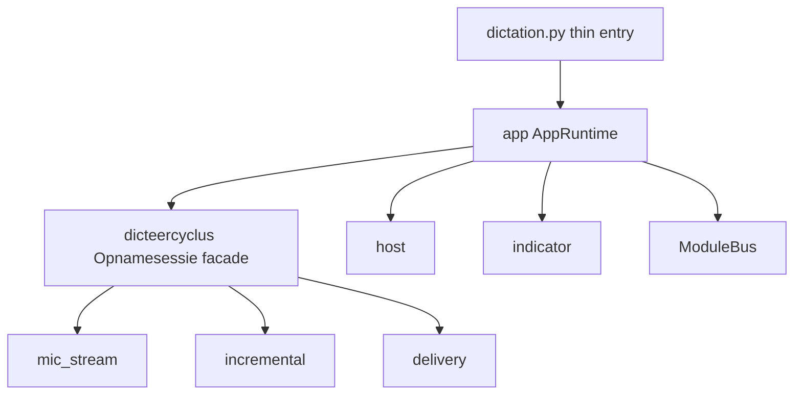

# Design: composition-root strangler

Datum: 2026-08-11  
Status: Draft  
ADR: [0007 — application composition root](../../adr/0007-application-composition-root.md)  
Behaviour freeze:
[`.scratch/architecture-rework/inventory.md`](../../../.scratch/architecture-rework/inventory.md)  
Plan:
[2026-08-11-composition-root-strangler.md](../plans/2026-08-11-composition-root-strangler.md)

## Probleem

`dictation.py` is tegelijk entrypoint, composition root, hotkey-router,
settings-apply en recovery/tray-wiring. `opnamesessie.py` mengt mic-stream,
incremental/chunk, delivery en timing. Sterke seams (`host`, indicator-contract,
ModuleBus) bestaan al; de diepte erachter niet. Import-time sessie-constructie
en gedeelde MB-stop via de dicteer-pill maken v1.0-hardening en UX Musts duur.

## Doel

Structurele strangler zonder productregressie:

1. Benoemde **composition root (`app`)** — zie CONTEXT + ADR-0007.
2. **`dicteercyclus/`** package met `Opnamesessie` façade en interne modules.
3. Dunne `dictation.py` entry.
4. Stabiele publieke contracts; characterization vóór moves.

## Behaviour freeze

Alle capabilities uit de inventory blijven (core Windows-belofte + experimentele
opt-in). Geen silent removals. Geen nieuwe features onder “rework”.

v1.0-belofte: Windows hotkey → Opnamesessie → lokaal Whisper → klembord/plakken
+ focus-veilige pill.

## Target layout

```text
dictation.py                 # thin: main → app.run (+ tijdelijke re-exports)
app/
  __init__.py
  runtime.py                 # AppRuntime
  bootstrap.py
  run.py / startup.py
  settings_service.py
  hotkey_router.py
  … clipboard / recent / recovery_actions …
dicteercyclus/
  __init__.py                # Opnamesessie façade (publieke naam behouden)
  mic_stream.py
  incremental.py
  delivery.py
  timing.py                  # optioneel / intern
host/  indicator/  modules/  ui/   # stabiele seams — geen rename
```



## Invarianten

| Onderwerp | Keuze |
|-----------|--------|
| Migratiestrategie | Strangler; geen clean-slate |
| Import-time session | Verboden; constructie in `run`/bootstrap |
| Publieke namen | `Opnamesessie`, ModuleBus, CycleEvent, `host`, indicator-contract |
| Events | Eén bus → journal; geen full transcript in journal |
| WASAPI pad | **Defer** — geen rename in deze epic |
| MB vs dicteer-stop | Pill/hotkey stopt alleen dicteercyclus |

## Parallel fixes (in epic, geen feature-creep)

1. Transcript-log redactie (default metadata only → `praatMaar.log`).
2. macOS `host.paste` restore + gedeelde entrypoint-resolutie voor launchers.
3. Docs honesty: ADR-0002 vs shipping `indicator._qt`; SECURITY.md ↔ ADR-0004.
4. UX Must restanten op nieuwe seams (PREPARING, non-modal errors, busy, ready-cue).

## Non-goals

- `src/praatmaar` big-bang rename
- ModuleBus / CycleEvent schema breken
- WASAPI path rename / dual-stack unificatie (Opnamesessie ≠ AudioCaptureEngine)
- Feature-creep, MB/local-llm graduation, cloud defaults
- Linux of Gatekeeper als supported claimen door schonere packages
- Rocket.Chat / DASH / Pulse (STT-ruis; geen integratie-scope)

## Success (design)

Inventory intact; ADR-0007 aanvaard en geïmplementeerd; thin entry + `app/` +
`dicteercyclus/` op Windows (incl. packaged smoke-pad); privacy-invarianten
code-afgedwongen; UX Musts ACs haalbaar op de nieuwe seams. Diepe MB-package
beauty mag follow-up zijn.
